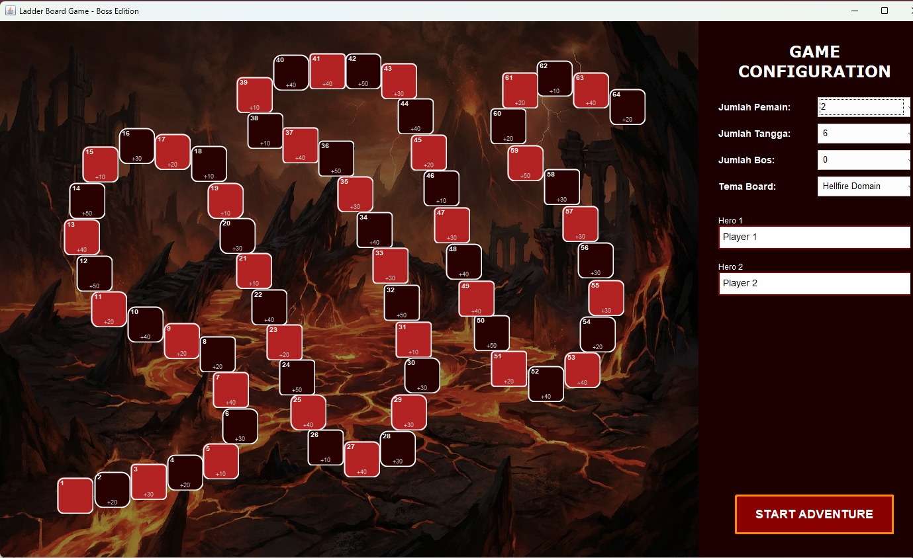
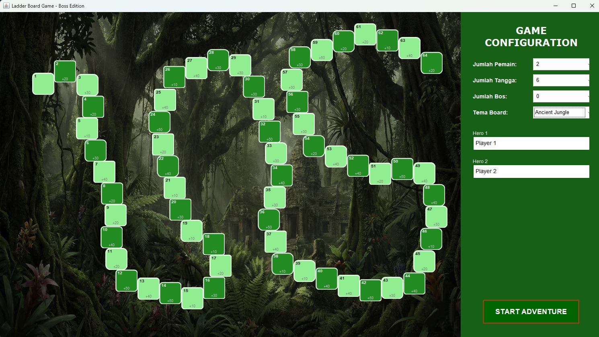
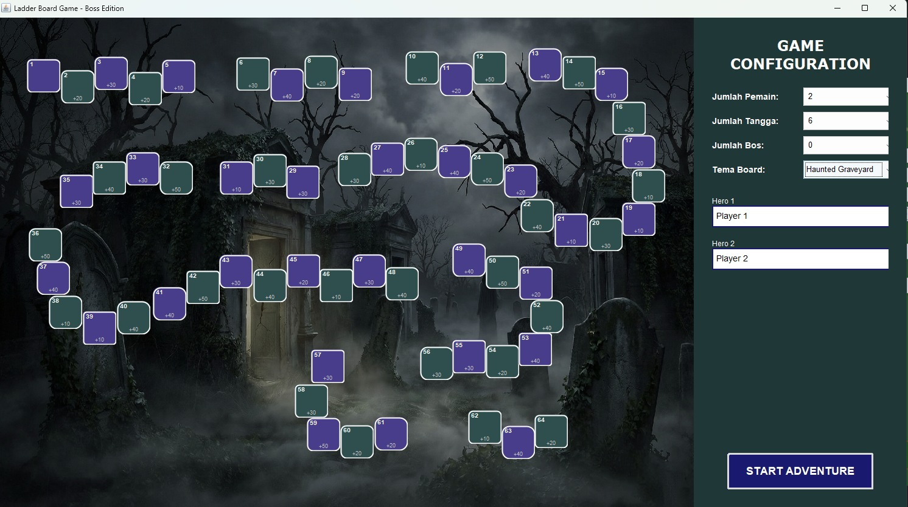
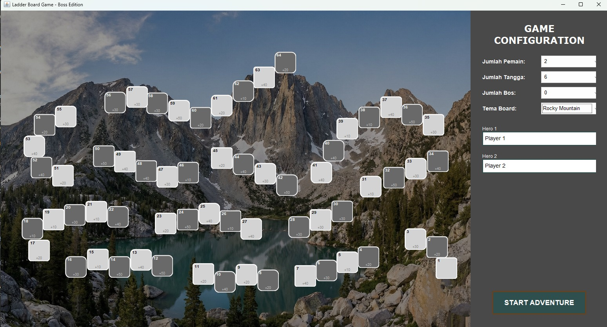

Group 20 | ASD(C)
- Rafsyah Fachri Isfansyah (5026241086)
- Laurentius Lafrellio Soewandi (5026241102)

# 🐍 Ular Tangga - Boss Edition (Java Swing)


**Ular Tangga - Boss Edition** adalah permainan papan klasik yang dikembangkan ulang menggunakan **Java Swing** dengan penambahan mekanik RPG unik seperti pertarungan Bos, aturan bilangan Prima, dan sistem pergerakan mundur. Proyek ini juga mengimplementasikan algoritma **Dijkstra** untuk kalkulasi animasi pergerakan pemain.

---

## 📸 Screenshots

| Hell Theme | Jungle Theme |
| :---: | :---: |
|  |  |

| Graveyard Theme | Mountain Theme |
| :---: | :---: |
|  |  |
---

## ✨ Fitur Utama

### 🎮 Gameplay Mekanik Baru
* **Boss Trap & Battle:** Pemain bisa terjebak di tile "Bos". Pemain harus mendapatkan dadu angka **6** untuk lolos. Jika lolos, pemain akan mencuri poin dari pemain lain.
* **Prime Number Ladders:** Tangga hanya bisa digunakan jika posisi tile awal adalah **Bilangan Prima**.
* **Red & Green Movement:**
    * 🟢 **Green:** Bergerak maju normal (70% peluang).
    * 🔴 **Red:** Bergerak mundur/reverse (30% peluang).
* **Extra Turn:** Mendapatkan giliran tambahan jika mendarat di tile kelipatan 5.

### 🎨 Visual & Tema
* **4 Tema Unik:** Hellfire Domain, Ancient Jungle, Haunted Graveyard, dan Rocky Mountain.
* **Dynamic Rendering:** Board digambar menggunakan `Graphics2D` dengan dukungan gambar latar belakang dan aset kustom.
* **Animasi Halus:** Pergerakan pion dianimasikan langkah demi langkah.

### 🧠 Algoritma
* **Dijkstra Pathfinding:** Menggunakan algoritma Dijkstra untuk menghitung jalur terpendek visual saat pion bergerak maju atau mundur, memberikan animasi pergerakan yang mulus antar tile.

---

## 🛠️ Teknologi yang Digunakan

* **Language:** Java (JDK 23 Compatible)
* **GUI Framework:** Java Swing & AWT
* **Audio:** Java Sound API (`javax.sound.sampled`)
* **Images:** `javax.imageio`

---

## 📂 Struktur Proyek

Berikut adalah penjelasan singkat mengenai kelas-kelas utama dalam proyek ini:

* **`UlarTanggaMain.java`**: Entry point aplikasi. Mengatur *game loop*, panel kontrol, logika dadu, dan inisialisasi algoritma.
* **`BoardPanel.java`**: Menangani rendering papan permainan, menggambar garis tangga (Dotted/Solid), posisi pemain, dan aset visual Bos.
* **`Player.java`**: Model data untuk pemain (Nama, Posisi, Skor, History Langkah).
* **`ThemeManager.java`**: Mengelola konfigurasi warna dan aset untuk setiap tema (Hell, Jungle, dsb).
* **`DicePanel.java`**: Komponen visual untuk menggambar mata dadu secara dinamis menggunakan `Graphics2D`.
* **`SoundUtility.java`**: Helper class untuk memutar efek suara (.wav) secara *asynchronous*.

---

## 🚀 Cara Menjalankan (How to Run)

### Prasyarat
* Java Development Kit (JDK) versi 8 atau lebih baru (Proyek ini dikonfigurasi untuk JDK 23).
* IDE Java (IntelliJ IDEA, Eclipse, atau NetBeans).

### Langkah-langkah
1.  **Clone Repository**
    ```bash
    git clone [https://github.com/username/UlarTangga-BossEdition.git](https://github.com/username/UlarTangga-BossEdition.git)
    ```
2.  **Buka di IDE**
    * Buka proyek menggunakan IntelliJ IDEA (folder `.idea` sudah disertakan).
3.  **Pastikan Resources Terload**
    * Pastikan folder `src/images` dan `src/sound` terbaca sebagai resource path agar gambar dan suara bisa dimuat.
4.  **Jalankan Aplikasi**
    * Run file `src/UlarTanggaMain.java`.

---

## 🎲 Aturan Permainan

1.  Pilih **Jumlah Pemain** (2-4) dan **Tema Papan** di menu konfigurasi.
2.  Tekan **SPACE** atau tombol "Roll Dadu" untuk mengocok dadu.
3.  **Maju/Mundur:** Tergantung keberuntungan, pemain bisa bergerak maju (Hijau) atau terpaksa mundur (Merah).
4.  **Tangga:** Jika pemain mendarat di pangkal tangga, pemain hanya akan naik jika angka tile tersebut adalah **Bilangan Prima**.
5.  **Bos:** Jika mendarat di tile Bos, pemain tertahan. Di giliran berikutnya, pemain harus mendapatkan angka 6 untuk bebas.
6.  **Pemenang:** Pemain pertama yang mencapai tile 64 (Finish) mendapat bonus poin besar dan permainan berakhir.

---

## 👨‍💻 Author

Dikembangkan sebagai proyek Pemrograman Berorientasi Objek (PBO) / Java GUI.

* **Developer:** [Nama Anda / Username GitHub]

---

> *Catatan: Pastikan file aset (.png dan .wav) berada di direktori yang benar saat menjalankan program agar tidak terjadi error NullPointerException.*
